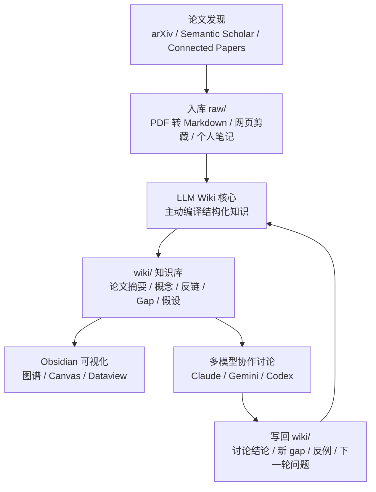
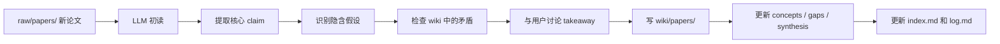

# 科研知识库与 LLM 协作工作流

本文档把三份材料合并成一套可落地的科研知识管理流程：

- 图片中的端到端流程：论文发现 -> raw 入库 -> LLM 编译 wiki -> Obsidian 可视化 -> 多模型讨论 -> 写回下一轮。
- PDF 中的目录结构、`CLAUDE.md` 规范和 prompt 设计。
- 额外约束：后续整理到 Obsidian 时，必须单独开一个科研板块，不影响已有 Obsidian 内容。

## 1. 目标和边界

### 1.1 目标

这套系统只针对一个核心需求：

> 积累科研领域经验，并与 LLM 协作讨论 idea。

它不是普通资料夹，也不是一次性 RAG 检索库。它的核心是让 LLM 主动把原始论文、笔记、讨论结果编译成一个持续增长的结构化 wiki。

### 1.2 边界

系统分为三层：

- `raw/`：原始材料层，只增不改。
- `wiki/`：LLM 编译层，LLM 负责维护，用户主要阅读和判断。
- `Obsidian`：可视化和阅读层，读取 `wiki/`，不直接破坏原始知识结构。

用户提供：

- 论文、网页、个人笔记。
- 研究方向判断。
- idea 是否值得继续追的主观决策。

LLM 负责：

- 读 raw。
- 写 wiki。
- 建立概念、论文、实体、gap、假设之间的 wikilink。
- 主动发现矛盾、缺口、反例和新问题。
- 将有价值的问答结果写回 wiki。

## 2. Obsidian 隔离原则

为了不影响你现有的 Obsidian 内容，推荐在现有 vault 中创建一个独立顶层目录：

```text
Research/
```

所有科研知识库内容都放在这个目录下面。不要修改现有 vault 根目录的首页、模板、日记、插件配置或其他知识库内容。

推荐结构：

```text
Obsidian Vault/
├── 你已有的其他内容/
├── 你已有的日记、项目、笔记/
└── Research/
    ├── README.md
    ├── CLAUDE.md
    ├── shared_research.md
    ├── raw/
    ├── wiki/
    └── prompts/
```

隔离规则：

- 只在 `Research/` 内创建和更新文件。
- `Research/raw/` 只增不改，避免 LLM 改写原始材料。
- `Research/wiki/` 由 LLM 维护。
- 不要求改变 Obsidian 全局 graph 设置。
- 如果要看局部图谱，使用 Obsidian 的 Local Graph，或在全局图谱里用路径过滤 `path:Research/`。
- 如果使用 Dataview，查询范围限制在 `"Research/wiki"`。
- 如果使用 Canvas，Canvas 文件也放在 `Research/wiki/canvas/` 或 `Research/canvas/` 内。

## 3. 总体流程



这个闭环的关键不是“存论文”，而是：

- 每篇论文都变成可链接的结构化页面。
- 每次讨论都沉淀成新的 wiki 页面。
- 每个 idea 都留下证据、反例、验证实验和状态。
- 每隔一段时间做 lint，发现孤儿页面、矛盾、过时结论和缺失概念。

## 4. 目录结构设计

在 Obsidian 中建议放在 `Research/` 下：

```text
Research/
├── README.md
├── CLAUDE.md
├── shared_research.md
│
├── raw/
│   ├── papers/
│   ├── notes/
│   └── assets/
│
├── wiki/
│   ├── index.md
│   ├── log.md
│   ├── overview.md
│   │
│   ├── papers/
│   │   └── [arxiv-id]-[short-title].md
│   │
│   ├── concepts/
│   │   └── [method-name].md
│   │
│   ├── entities/
│   │   └── [name].md
│   │
│   ├── comparisons/
│   │   └── [topic]-comparison.md
│   │
│   ├── gaps/
│   │   ├── confirmed-gaps.md
│   │   ├── hypotheses.md
│   │   └── questions.md
│   │
│   ├── synthesis/
│   │   ├── field-map.md
│   │   ├── shared-assumptions.md
│   │   └── discussion-[date].md
│   │
│   └── canvas/
│       └── [topic].canvas
│
└── prompts/
    ├── ingest-paper.md
    ├── field-overview.md
    ├── idea-generation.md
    ├── lint-wiki.md
    └── multi-model-debate.md
```

### 4.1 `raw/`

`raw/` 是证据层。

- `raw/papers/`：MinerU / Marker 转换后的论文 Markdown。
- `raw/notes/`：你自己的笔记、arXiv 页面 clip、Semantic Scholar 摘要、网页摘录。
- `raw/assets/`：图、表、截图、本地图片。

规则：

- 只增不改。
- LLM 可以读取，但不写入。
- 文件名尽量保留来源信息，例如 `2401.xxxxx-title.md`。
- 对每篇论文保留 arXiv ID、标题和来源链接。

### 4.2 `wiki/`

`wiki/` 是 LLM 编译后的知识层。

- `wiki/papers/`：每篇论文一个页面。
- `wiki/concepts/`：每个方法、理论、机制一个页面。
- `wiki/entities/`：作者组、数据集、系统、benchmark、机构。
- `wiki/comparisons/`：方法对比、实验对比、路线对比。
- `wiki/gaps/`：研究空白、开放问题、假设。
- `wiki/synthesis/`：跨论文综合理解。

规则：

- LLM 可以写。
- 用户可以读和人工修订，但建议保留 LLM 操作日志。
- 所有重要页面尽量用 `[[wikilink]]` 连接。
- 高价值问答结果要写回 `wiki/synthesis/` 或 `wiki/comparisons/`。

### 4.3 `gaps/` 和 `synthesis/`

这两个目录是 idea 生成的核心。

`wiki/gaps/` 关注“还能做什么”：

- `confirmed-gaps.md`：已经被证据支持的研究空白。
- `hypotheses.md`：创新假设，带状态。
- `questions.md`：还没有答案的开放问题。

`wiki/synthesis/` 关注“我如何理解这个领域”：

- `field-map.md`：方法谱系、演化逻辑、路线分叉。
- `shared-assumptions.md`：多篇论文共同依赖但很少质疑的隐含假设。
- `discussion-[date].md`：每轮多模型讨论后写回的结论。

## 5. `CLAUDE.md` 学术研究模板

下面内容建议后续直接放到 `Research/CLAUDE.md`。

```md
# Research Wiki Schema

## 你的身份

你是这个研究知识库的唯一维护者。

你的目标：将 `raw/` 中的论文积累成有结构的知识，帮助发现研究空白和创新方向。

你写 `wiki/`，用户读 `wiki/`。用户提供原材料和方向判断，你做所有整理工作。

## 目录约定

- `raw/papers/` -> 原始论文 Markdown，只读
- `raw/notes/` -> 用户笔记、网页剪藏，只读
- `raw/assets/` -> 图片、图表、本地材料，只读
- `wiki/papers/` -> 论文摘要页，你写
- `wiki/concepts/` -> 方法/理论概念页，跨论文综合
- `wiki/entities/` -> 作者组、数据集、benchmark、系统
- `wiki/comparisons/` -> 对比表，对比类问题的答案直接存这里
- `wiki/gaps/` -> 研究空白、假设、开放问题
- `wiki/synthesis/` -> 领域综合理解，定期更新
- `wiki/index.md` -> 所有页面目录，每次操作后更新
- `wiki/log.md` -> 操作日志，append-only

## 论文摘要页格式

论文页面放在 `wiki/papers/`。

文件名格式：

`[arxiv-id]-[short-title].md`

Frontmatter:

---
paper_id: [arXiv ID]
title:
authors:
year:
venue:
status: [read/skimmed/queued]
confidence: [high/medium/low]
tags: []
---

## 一句话贡献

[用一句话说清这篇论文的核心贡献]

## 问题设定

[这篇论文要解决什么问题？为什么之前的方法不够好？]

## 方法核心

[用自己的话解释关键方法，公式用 LaTeX，重点不是复述而是理解]

## 实验结论

[关键数值结果，和 baseline 的对比]

## 局限性和假设

[论文自己承认的局限 + 你识别到的隐含假设]

## 与已有工作的关系

- 建立在: [[concept-name]], [[paper-id]]
- 被引用:
- 矛盾:

## Gap 线索

[这篇论文暗示但没做的方向。要具体，不要客套]

## 操作规范

### Ingest 新论文

1. 读取 `raw/papers/[id].md`。
2. 和用户讨论 2-3 个关键 takeaway。
3. 写 `wiki/papers/[id]-[short-title].md`。
4. 更新相关 `wiki/concepts/` 页面。
5. 如果发现矛盾，在相关页面中都显式标注。
6. 如果发现新问题，更新 `wiki/gaps/questions.md`。
7. 如果发现新 gap，更新 `wiki/gaps/confirmed-gaps.md` 或 `wiki/gaps/hypotheses.md`。
8. 更新 `wiki/index.md` 和 `wiki/log.md`。

### Query 问答

1. 先读 `wiki/index.md` 找相关页面。
2. 再读取相关 `papers/`、`concepts/`、`gaps/`、`synthesis/` 页面。
3. 回答时区分：证据支持、间接推断、猜测。
4. 如果答案有长期价值，主动问用户是否写入 `wiki/`。
5. 对比类问题写入 `wiki/comparisons/`。
6. 综合分析写入 `wiki/synthesis/`。

### Lint 健康检查

检查并报告：

- 孤儿页面，没有入链或出链。
- 明确矛盾，标注冲突论文/概念。
- 过时声明，被新论文否定的结论。
- 高频概念，出现 3 次以上但没有独立 `concepts/` 页面。
- `wiki/gaps/questions.md` 中的开放问题是否已有新论文可以回答。

### Idea 生成

当用户要求讨论创新方向时：

1. 读取 `wiki/synthesis/shared-assumptions.md`。
2. 从 `wiki/gaps/confirmed-gaps.md` 选取 2-3 个方向。
3. 提出假设，并说明：前提条件、若成立的影响、已有间接证据。
4. 主动挑战自己：这个假设哪里最弱？哪篇论文可能是反例？
5. 给出最小可验证实验。
6. 结论写入 `wiki/gaps/hypotheses.md`，标注状态为 `draft`。

## Frontmatter 约定

`confidence`:

- `high`：有直接实验支持。
- `medium`：有间接证据。
- `low`：推测。

论文 `status`:

- `queued`
- `skimmed`
- `read`

假设 `status`:

- `draft`
- `testing`
- `confirmed`
- `rejected`
```

## 6. 论文 Ingest 工作流

### 6.1 输入

来源可以是：

- arXiv RSS。
- arXiv email alert。
- Semantic Scholar alert。
- Connected Papers 图谱。
- 手动下载 PDF。
- Obsidian Web Clipper。
- 你自己的阅读笔记。

论文进入系统前，先转成 Markdown：

- PDF -> MinerU / Marker -> `Research/raw/papers/`
- 网页 / 摘要 / Semantic Scholar TLDR -> `Research/raw/notes/`
- 图表 / 截图 -> `Research/raw/assets/`

### 6.2 处理步骤



### 6.3 Ingest prompt

```md
处理论文：`Research/raw/papers/[paper-id].md`

先读一遍，然后告诉我：

1. 这篇论文的核心 claim 是什么？用一句话回答。
2. 它假设了什么在我的领域里大家都没有质疑过的东西？
3. 有没有和 `Research/wiki/` 里已有内容矛盾的地方？

讨论完之后，按 `Research/CLAUDE.md` 的格式写入 `Research/wiki/`。

重点把“Gap 线索”这一栏写得具体，不要客套。
如果你认为这篇论文没有形成新 gap，也要明确说明原因。
```

## 7. Query 答案写回机制

这套系统的复利来自“好答案写回 wiki”。

一次对比分析、一次概念澄清、一个反例连接、一段多模型讨论结论，都不应该只留在聊天记录里。

写回规则：

- 问题是论文对比 -> 写到 `wiki/comparisons/`。
- 问题是领域理解 -> 写到 `wiki/synthesis/`。
- 问题是研究空白 -> 写到 `wiki/gaps/questions.md` 或 `wiki/gaps/confirmed-gaps.md`。
- 问题是创新假设 -> 写到 `wiki/gaps/hypotheses.md`。
- 问题是方法解释 -> 写到 `wiki/concepts/`。

通用写回 prompt：

```md
把这次分析的核心结论写入 wiki。

要求：

- 200 字以内总结核心结论。
- 放到最合适的位置：`comparisons/`、`synthesis/`、`gaps/` 或 `concepts/`。
- 补充必要 wikilink。
- 更新 `Research/wiki/index.md`。
- 追加更新 `Research/wiki/log.md`。
- 不要修改 `Research/raw/`。
```

## 8. 领域全景讨论机制

### 8.1 目标

周期性生成一个“我现在如何理解这个领域”的版本。

这个机制服务于：

- 理清主流方法谱系。
- 找到隐含假设。
- 观察最近论文是否暗示范式变化。
- 为 idea 生成提供背景。

### 8.2 Prompt

```md
现在我要和你讨论 [研究方向] 的现状。

请读取：

- `Research/wiki/overview.md`
- `Research/wiki/synthesis/field-map.md`
- `Research/wiki/synthesis/shared-assumptions.md`
- 最近更新的 3 篇 `Research/wiki/papers/` 页面

然后告诉我：

1. 按照 wiki 里记录的内容，这个领域目前主流的方法谱系是什么？
   用“问题 -> 主流解法 -> 代表论文”的格式整理。
2. 所有这些方法共享什么隐含假设？
   哪个假设是最脆弱的，但很少有论文去质疑它？
3. 最近入库的 3 篇论文里有没有暗示某种范式转变？

回答结束后问我：要不要把这次讨论的结论写进 `Research/wiki/synthesis/`？
```

## 9. Idea 生成机制

### 9.1 目标

Idea 生成不是让 LLM 随便发散，而是让它基于已有 wiki：

- 找 confirmed gap。
- 识别 shared assumption。
- 提出假设。
- 找反对理由。
- 给最小验证实验。

### 9.2 Prompt

```md
我们现在进入创新点讨论模式。

背景：

- 读取 `Research/wiki/gaps/confirmed-gaps.md`
- 读取 `Research/wiki/gaps/questions.md`
- 读取 `Research/wiki/synthesis/shared-assumptions.md`

任务：

围绕 [具体方向/问题]，提出 3 个研究假设。

对每个假设，你必须：

1. 说清楚它和哪些已有工作的区别，引用 wiki 里的具体论文。
2. 说清楚最强的反对理由是什么，哪篇论文可能是反例。
3. 如果这个假设成立，最小的可验证实验是什么？

你不需要讨好我。
如果某个想法很普通，直接说。
如果有比我问的方向更有价值的空白，告诉我。

讨论后，把达成共识的假设写入 `Research/wiki/gaps/hypotheses.md`。

要求：

- 标注 `status: draft`。
- 记录今天日期。
- 记录讨论要点。
- 写入相关 wikilink。
- 更新 `Research/wiki/log.md`。
```

### 9.3 假设记录格式

```md
## [假设标题]

status: draft
date: YYYY-MM-DD
confidence: low
related:
  - [[paper-id-short-title]]
  - [[concept-name]]
  - [[confirmed-gap-name]]

### 假设

[一句话说明假设]

### 前提条件

- [前提 1]
- [前提 2]

### 区别于已有工作

[引用 wiki 中具体论文和概念说明差异]

### 最强反对理由

[哪篇论文或哪个实验可能推翻它]

### 最小可验证实验

[最小实验设计，不要空泛]

### 下一步

[需要找什么论文、跑什么实验、问什么问题]
```

## 10. Lint 健康检查机制

建议每 1-2 周做一次。

### 10.1 检查内容

- 3 篇以上论文出现但没有独立页面的概念。
- `hypotheses.md` 里的 `draft` 假设是否出现新证据或反例。
- `overview.md` 和 `field-map.md` 里是否有被最近论文推翻的结论。
- 两篇论文之间是否存在矛盾。
- 是否有孤儿页面。
- 是否有没有写回 index 的页面。
- 是否有 gap 没有链接到具体论文。

### 10.2 Lint prompt

```md
对 `Research/wiki/` 做一次健康检查。

检查并生成报告：

1. 有哪些概念在 3 篇以上论文里出现，但没有独立的 `concepts/` 页面？
2. 哪些 `hypotheses.md` 里的 `draft` 假设，在新入库的论文里找到了证据或反例？
3. `overview.md` 和 `field-map.md` 里有没有被最近论文推翻的结论？
4. 找出任何两个论文页面之间存在的矛盾，包括不同实验结论、不同假设、不同适用条件。
5. 找出孤儿页面和缺失反链的页面。

报告格式：

## 需要创建的新概念页面

## 假设状态更新

## 需要修订的声明

## 检测到的矛盾

## 孤儿页面和链接问题

先只报告，不要自动修改。
等我确认后，再执行修复。
```

## 11. Obsidian 可视化层

Obsidian 主要负责可视化和阅读，不负责替代 LLM 编译。

### 11.1 推荐视图

- Graph View：看 `wiki/` 里的论文、概念、gap、实体之间的关系。
- Local Graph：围绕一个假设或概念看局部连接。
- Canvas：画某个研究方向的逻辑图。
- Dataview：统计论文状态、假设状态、gap 数量。
- Search：基于 `wiki/log.md` 和 frontmatter 快速定位。

### 11.2 Dataview 示例

只查科研板块，避免扫到其他 Obsidian 内容。

```dataview
TABLE title, year, status, confidence
FROM "Research/wiki/papers"
SORT year DESC
```

```dataview
TABLE status, confidence, date
FROM "Research/wiki/gaps"
WHERE contains(file.name, "hypotheses")
```

```dataview
LIST
FROM "Research/wiki/concepts"
SORT file.mtime DESC
```

### 11.3 Graph 过滤建议

在全局图谱中可以使用路径过滤：

```text
path:Research/wiki
```

如果你只想看 gap 和 synthesis：

```text
path:Research/wiki/gaps OR path:Research/wiki/synthesis
```

## 12. 多模型协作协议

多模型协作不是让模型同时闲聊，而是给每个模型明确分工。

建议角色：

- Claude Code：综合 wiki 内容，维护结构化知识，写回 `wiki/`。
- Gemini CLI：联网验证，搜索最新论文和外部证据。
- Codex CLI：挑漏洞，找反例，指出假设最弱处。
- Perplexity：新颖性粗查和外部引用线索。

### 12.1 共享文件

所有模型围绕一个共享文件协作：

```text
Research/shared_research.md
```

### 12.2 `shared_research.md` 模板

```md
# Shared Research

## 当前讨论轮次

YYYY-MM-DD

## 议题

[具体问题，例如：是否应该挑战 X 假设]

## wiki 相关摘录

[由 Claude Code 从 `Research/wiki/gaps/confirmed-gaps.md`、`Research/wiki/concepts/`、`Research/wiki/papers/` 中摘出关键段落]

## 上轮结论摘要

[上次讨论写回的结论]

## 本轮任务

### Claude

综合 wiki 内容，给出结构化判断：

- 这个问题在现有 wiki 中处于什么位置？
- 已有证据支持什么？
- 哪些 gap 和 hypothesis 相关？
- 是否值得写回 `wiki/synthesis/` 或 `wiki/gaps/`？

### Gemini

联网搜索是否有 2025 年后的最新论文支持或反驳上述分析。

输出要求：

- 给出论文标题、年份、链接。
- 标注支持、反驳、相关但不直接。
- 不要只给搜索结果，要说明它如何影响当前假设。

### Codex

挑最弱的假设，找已有论文里的反例。

输出要求：

- 指出最脆弱前提。
- 找可能反例。
- 说明需要什么最小实验来区分当前假设和反例。

## 汇总区

[用户或 Claude Code 汇总三方结论后写入]

## 写回决定

- [ ] 写入 `Research/wiki/synthesis/discussion-YYYY-MM-DD.md`
- [ ] 更新 `Research/wiki/gaps/hypotheses.md`
- [ ] 更新 `Research/wiki/gaps/questions.md`
- [ ] 更新 `Research/wiki/log.md`
```

### 12.3 多模型辩论 prompt

```md
请读取 `Research/shared_research.md`。

本轮你的角色是：[Claude / Gemini / Codex]。

只完成 `shared_research.md` 中分配给你的任务。

要求：

- 不要泛泛而谈。
- 引用具体 wiki 页面或外部论文。
- 明确区分证据、推断和猜测。
- 如果发现更重要的问题，可以指出，但不要偏离本轮议题。
```

## 13. 常用 Prompt 库

后续可以把本节拆成 `Research/prompts/` 下的独立文件。

### 13.1 新论文处理

```md
处理论文：`Research/raw/papers/[paper-id].md`

请按以下顺序工作：

1. 提取一句话核心 claim。
2. 提取问题设定和方法核心。
3. 找出显式局限和隐含假设。
4. 检查和 `Research/wiki/` 已有内容的关系。
5. 给出 2-3 个关键 takeaway，先和我讨论。

讨论完成后，再写入 `Research/wiki/papers/`。
```

### 13.2 方法对比

```md
请比较 [方法 A] 和 [方法 B]。

先读取：

- `Research/wiki/concepts/[方法 A].md`
- `Research/wiki/concepts/[方法 B].md`
- 相关 `Research/wiki/papers/`

输出：

1. 它们解决的问题是否相同？
2. 核心假设有什么不同？
3. 实验设置是否可比？
4. 哪些结论可能互相矛盾？
5. 对我的研究 idea 有什么影响？

如果这个对比有长期价值，请写入 `Research/wiki/comparisons/[topic]-comparison.md`。
```

### 13.3 反例搜索

```md
请针对下面假设找反例：

[粘贴假设]

读取：

- `Research/wiki/gaps/hypotheses.md`
- 相关 `Research/wiki/papers/`
- 相关 `Research/wiki/concepts/`

要求：

1. 找出最可能推翻它的已有论文。
2. 说明反例是直接反驳，还是只是在不同条件下不成立。
3. 给出一个最小实验，用来区分假设和反例。
4. 如果假设需要降级或改写，请给出改写版本。
```

### 13.4 写回讨论结论

```md
把这次讨论写回 `Research/wiki/synthesis/discussion-[今天日期].md`。

要求：

- 200 字以内总结核心结论。
- 列出本轮新增的 gap、hypothesis、反例或开放问题。
- 添加相关 wikilink。
- 如需要，更新 `Research/wiki/gaps/hypotheses.md`。
- 更新 `Research/wiki/index.md`。
- 追加 `Research/wiki/log.md`。
```

## 14. 每周和每月维护节奏

### 14.1 每次读论文

1. PDF / 网页进入 `raw/`。
2. LLM 生成 `wiki/papers/` 页面。
3. 更新相关 `concepts/`。
4. 把 gap 写到 `gaps/`。
5. 更新 `index.md` 和 `log.md`。

### 14.2 每周

1. 做一次轻量 lint。
2. 检查 `questions.md` 有没有可以推进的问题。
3. 从 `confirmed-gaps.md` 选 1 个方向做 idea 讨论。
4. 把讨论结果写到 `discussion-[date].md`。

### 14.3 每月

1. 更新 `overview.md`。
2. 更新 `field-map.md`。
3. 更新 `shared-assumptions.md`。
4. 清理 `hypotheses.md` 状态：
   - `draft` -> `testing`
   - `testing` -> `confirmed`
   - `testing` -> `rejected`
5. 检查是否有值得进入实验设计的 idea。

## 15. 后续落地到 Obsidian 的拆分方案

当前文档是总纲。后续进入 Obsidian 时，建议拆成以下文件：

```text
Research/
├── README.md
├── CLAUDE.md
├── shared_research.md
├── prompts/
│   ├── ingest-paper.md
│   ├── field-overview.md
│   ├── idea-generation.md
│   ├── lint-wiki.md
│   └── multi-model-debate.md
└── wiki/
    ├── index.md
    ├── log.md
    ├── overview.md
    ├── gaps/
    │   ├── confirmed-gaps.md
    │   ├── hypotheses.md
    │   └── questions.md
    └── synthesis/
        ├── field-map.md
        └── shared-assumptions.md
```

建议迁移顺序：

1. 在 Obsidian vault 中创建 `Research/` 顶层目录。
2. 把本文档放入 `Research/README.md` 或 `Research/_system/research-wiki-workflow.md`。
3. 从本文档中拆出 `CLAUDE.md`。
4. 拆出 `prompts/`。
5. 创建空的 `raw/` 和 `wiki/` 目录。
6. 先处理 3 篇论文，跑通 ingest -> wiki -> query -> write-back。
7. 再启用 Obsidian Graph、Canvas 和 Dataview。

## 16. 最小启动版本

如果只想先跑起来，最小结构是：

```text
Research/
├── CLAUDE.md
├── shared_research.md
├── raw/
│   └── papers/
└── wiki/
    ├── index.md
    ├── log.md
    ├── papers/
    ├── concepts/
    ├── gaps/
    │   ├── confirmed-gaps.md
    │   ├── hypotheses.md
    │   └── questions.md
    └── synthesis/
        ├── field-map.md
        └── shared-assumptions.md
```

先不要追求自动化。最重要的是形成习惯：

- 原文只进 `raw/`。
- LLM 输出只进 `wiki/`。
- 好问答必须写回。
- 每周做一次 lint。
- 每个 idea 必须接受反例挑战。

## 17. 设计原则总结

这套系统的纪律可以压缩成五句话：

1. `raw/` 是证据，不改写。
2. `wiki/` 是理解，由 LLM 维护。
3. `gaps/` 和 `synthesis/` 是 idea 的发动机。
4. 好答案必须写回，否则知识不会复利。
5. 多模型协作必须分工：综合、联网、挑刺，不要混成一锅聊天。
